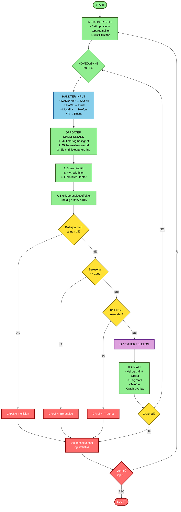
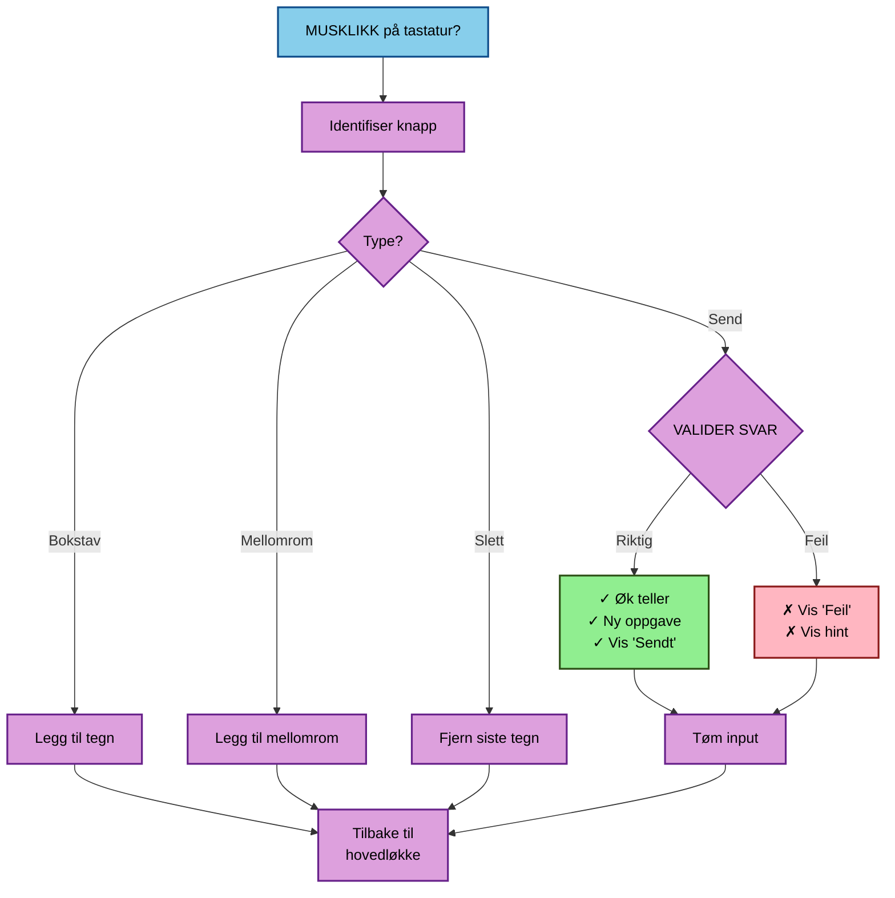
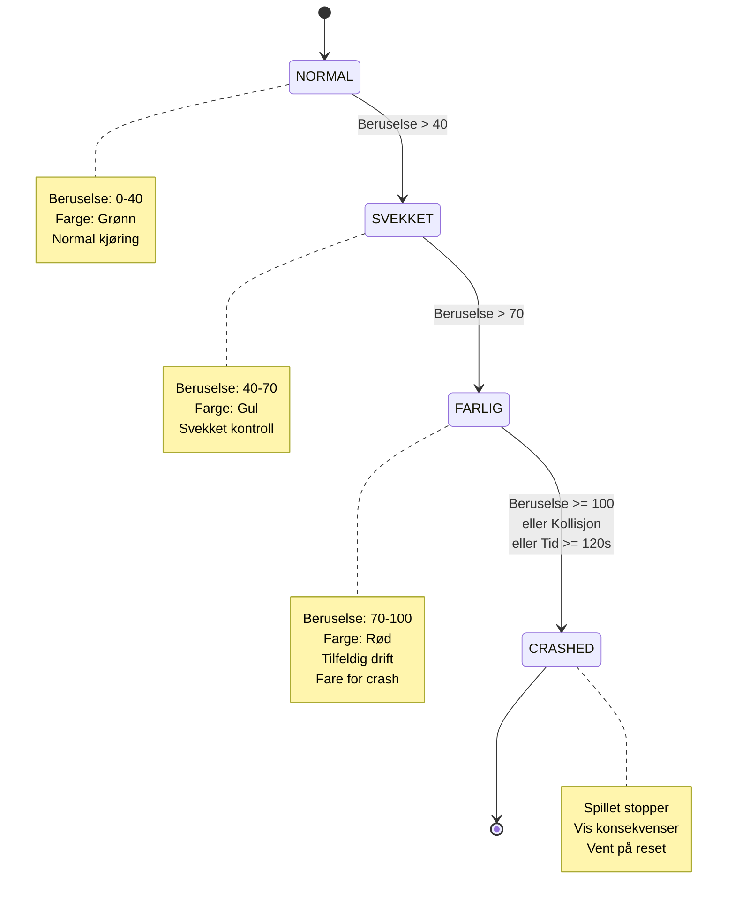

# Dont Drink & Drive & Text

Et 2D top-down Python-spill bygget med pygame-ce for trafikksikkerhet og forebygging.

Spilleren styrer en bil samtidig som hen blir presset til å drikke og svare på meldinger på en telefon ved siden av veien. Opplevelsen starter lystig, men eskalerer til en alvorlig slutt som viser konsekvensene av ruspåvirket og distrahert kjøring.

## Beta-status

### Prosjektbeskrivelse
`Dont Drink & Drive & Text` er et interaktivt præventivspill som bruker ubehagelig spillmekanikk for å øke bevissthet omkring risikoen ved ruspåvirket og distrahert kjøring. Spilleren møter eskalerende utfordringer: kjøreoppdrag, telefonmeldinger og drikkepress som legger vekt på multitasking. Etter to minutter oppstår uunngåelig krasj, noe som gir et tydelig og alvorlig budskap om konsekvensene.

### Hva virker i beta?
**Fungerende funksjoner:**
- Top-down kjøring i tre kjørefelt med møtende trafikk
- Interaktiv telefonpanel med tekstmeldinger som skal besvares
- Klikkbart on-screen tastatur (norsk layout med Æ, Ø, Å)
- Beruselsesskala som eskalerer og påvirker bilkontroll
- Case-insensitive tekstvalidering med hint-system
- Balansert spillengde (~2 minutter til uunngåelig krasj)
- Krasjsekvens med statistikk og alvorlig budskap

**Kjente begrensninger i beta:**
- Web-deployment via Pygbag under utprøving
- Grafisk elementer og animasjoner er minimale
- Ingen lyd eller musikk implementert ennå
- Kun 5 meldingsoppdrag (kan utvides)

### Hvordan kjøre

**Krav:**
- Python 3.10 eller høyere
- pygame-ce 2.5.7 eller høyere

**Installasjon (Windows):**
```powershell
cd c:\[Filplaseringen]\DontDrinkDriveText2D
python -m venv .venv
Set-ExecutionPolicy -Scope Process -ExecutionPolicy Bypass
.\.venv\Scripts\Activate.ps1
pip install -r requirements.txt
python main.py
```

**Kjør på annet OS (Mac/Linux):**
```bash
python3 -m venv .venv
source .venv/bin/activate
pip install -r requirements.txt
python main.py
```

### Web-versjon (itch.io med pygbag)

Prosjektet er klargjort for web-kjoring via `pygbag`.

1. Installer web-avhengigheter:
```powershell
pip install -r requirements-web.txt
```

2. Bygg web-versjonen fra prosjektroten:
```powershell
.\build_web.ps1
```

3. Ferdig zip for itch lages automatisk som `build/web.zip`.

4. Last opp zip-filen til itch.io som et `HTML`-prosjekt.

5. Ved nye oppdateringer: bygg pa nytt og last opp ny zip til samme itch-side.

### Demo-scenario: Kort opplevelse av kjernefunksjonen

1. **Start spillet:** `python main.py`
2. **Kjør rett fremover:** Bruk `A`/`D` eller piltaster for å holde deg i kjørefeltene
3. **Møt første meldingsoppgave:** En tekstmelding dukker opp på telefonpanelet (høyre side)
4. **Svar på meldingen:** Klikk på bunn-tastaturet og skriv et svar (se hint hvis du er usikker)
5. **Drikk når oppfordret:** Trykk `Space` når "Drikk"-knappen vises
6. **Opplev eskalasjon:** Trafikk og beruselsesskala øker gradvis
7. **Krasj oppstår:** Etter ~120 sekunder oppstår uunngåelig krasj – det er intentjonelt!
8. **Se konsekvensen:** Krasjskjermen viser statistikk og alvorlig budskap

### Kjente feil og risiko

| Feil/Risiko | Alvorlighetsgrad | Status |
|-------------|-----------------|--------|
| Tekstfelt kan fryses hvis man skriver for raskt i begge paneler simultant | Lav | Observert, kreves testing |
| Web-versjon (Pygbag) krever ytterligere testing på ulike nettlesere | Medium | Planlagt arbeid |
| Grafisk ytelse ved høy trafikktetthet | Lav | Ikke kritisk ved 60 FPS |
| No-sound situasjon kan gjøre opplevelsen mindre engasjerende | Lav | Fremtidig forbedring |

## Konkurransepitch

`Dont Drink & Drive & Text` er bevisst laget for å være ubehagelig:
- Tidlig i spillet belønnes farlig multitasking med positiv feedback.
- Vanskelighetsgrad og beruselse øker gradvis til kontrollen svikter.
- Krasjsekvensen gir tydelig budskap om konsekvenser og forebygging.

Hovedmålet er at spilleren sitter igjen med en sterkere risikoforståelse.

## Funksjoner

- Top-down kjøring i felt med møtende/hindrende trafikk
- Telefonpanel med meldingsmål og klikkbart tastatur på skjermen
- Flere meldinger har flere gyldige svaralternativer
- Svar valideres uten krav om store bokstaver (caps)
- Økende beruselsesnivå som påvirker kontrollen
- Dynamisk økning av fart og trafikk
- Krasj gjennom kollisjon eller uunngåelig tidsbegrensning
- Konsekvensskjerm med statistikk og tydelig budskap

## Kontroller

- `A` / `Venstre pil`: flytt til venstre felt
- `D` / `Høyre pil`: flytt til høyre felt
- `Space`: drikk når du blir oppfordret
- Musklikk på telefontastaturet: skriv/slett/send melding
- `R`: start på nytt etter krasj
- `Esc`: avslutt

## Krav

- Python 3.10+
- pygame-ce 2.5+

## Installer og kjør

```powershell
cd c:\Users\olr\UGNASync\DontDrinkDriveText2D
python -m venv .venv
.\.venv\Scripts\Activate.ps1
pip install -r requirements.txt
python main.py
```

# Skisse og design

## Mermaid Flytskjema: Dont Drink & Drive & Text


---



---

### Telefonsystem (Parallelt subsystem)



---

### Tilstandsdiagram



## Prosjektstruktur

```text
DontDrinkDriveText2D/
├─ docs/
│  ├─ CONTEST_SUBMISSION.md
│  ├─ GAME_DESIGN.md
│  └─ TECHNICAL_DOCUMENTATION.md
├─ src/
│  └─ dddt_game/
│     ├─ __init__.py
│     ├─ config.py
│     ├─ entities.py
│     ├─ game.py
│     └─ phone.py
├─ main.py
└─ requirements.txt
```

## Pedagogisk ramme

Spillet viser farlig adferd for å motvirke den:
- Dette er forebyggingsinnhold, ikke oppmuntring.
- Spillet er med vilje tragisk i utviklingen.

## DESIGN

- **Skisser/wireframes eller skjermbilder av beta:**
    - Nåværende beta bruker funksjonelle skjermbilder i stedet for separate wireframes.
    - Hovedvisning: vei, spillerbil, trafikk, HUD og telefonpanel i ett vindu.
    - Crash-overlay: tydelig avslutningsskjerm med årsak, statistikk og reset-instruks.
- **Brukerflyt (flytdiagram/brukerreise):**
    - Se Mermaid-flytene over i denne README-en (hovedflyt, telefonsystem og tilstandsdiagram).
    - Brukerreise: start → kjøre og håndtere distraksjoner → økende beruselse/stress → krasj → refleksjon.
- **Designvalg og hvorfor de støtter budskapet:**
    - **Farger:** grønn/gul/rød progressjon visualiserer risikoeskalering intuitivt.
    - **Typografi:** enkel, lettleselig UI-font for rask avlesning under press.
    - **UI-komponenter:** beruselsesbar, meldingsfelt, tastatur og crash-overlay forsterker multitasking-konflikten.
    - **Helhet:** bevisst enkel grafisk stil holder fokus på valg og konsekvens, ikke kosmetikk.

## TEKNISK

- **Arkitektur (moduler, mapper, hovedkomponenter):**
    - `main.py`: oppstart og kjøring av spillet.
    - `src/dddt_game/config.py`: sentrale konstanter og balanseringsparametere.
    - `src/dddt_game/entities.py`: spillerbil, trafikkbiler og bevegelseslogikk.
    - `src/dddt_game/phone.py`: meldingsoppgaver, tastaturinput og validering.
    - `src/dddt_game/game.py`: hovedløkke, tilstander, rendering og kollisjonshåndtering.
- **Algoritmer/logikk (kjerne):**
    - Tidsbasert oppdatering (delta-time) for stabil bevegelse på tvers av FPS.
    - Progressiv beruselsesmodell som påvirker kontroll og leder mot farlig tilstand.
    - Trafikkspawning med intervall/hastighet som øker press over tid.
    - Tekstvalidering med flere gyldige svar og case-insensitive sammenligning.
- **Data (lagring):**
    - Ingen database i beta.
    - Filbasert/innkodet data i kode (meldingsoppgaver og konfigurasjon).
    - Midlertidig runtime-statistikk per spillrunde (tid, meldinger, krasjårsak).
- **Teknologivalg og begrunnelse:**
    - **Python + pygame-ce** valgt for rask iterasjon, enkel 2D-rendering og god kontroll på spill-løkke.
    - pygame-ce gir moderne kompatibilitet (inkludert nyere Python-versjoner).
    - Lav teknisk terskel gjør prosjektet egnet for pedagogisk prototyping i konkurranseformat.

## TESTPLAN (for beta)

- **Hva testes nå:**
    - Funksjoner: input, kollisjon, telefon, reset, tilstandsoverganger.
    - Brukervennlighet: forståelig UI, lesbarhet, respons i tastatur/telefon.
    - Ytelse: jevn opplevelse rundt mål på 60 FPS i normal trafikkmengde.
- **Testcases (input → forventet resultat):**
    1. Start spill → spillerbil vises i felt, timer starter, ingen crash ved oppstart.
    2. Trykk `A`/`D` gjentatte ganger → bilen bytter felt mykt uten hopp.
    3. Vent til drikkeoppfordring + trykk `Space` → beruselsesnivå øker synlig.
    4. Klikk bokstaver på telefontastatur → tekstlinje oppdateres korrekt.
    5. Send korrekt melding → teller øker og ny oppgave lastes.
    6. Send feil melding → feilmelding/hint vises, teller øker ikke.
    7. Kjør inn i trafikkbil → crash-overlay vises med årsak «Kollisjon».
    8. Spill til `>= 120` sekunder uten kollisjon → crash med tids-/tretthetsårsak.
    9. Etter crash, trykk `R` → ny runde starter med nullstilte verdier.
    10. Etter crash, trykk `Esc` → spillet avsluttes kontrollert.
- **Testmiljø:**
    - OS: Windows 10/11 (primær), sekundært mål Mac/Linux.
    - Oppløsning: 1280x720 (standard test), også testet i vindusmodus.
    - Spillbibliotek: pygame-ce 2.5.7.
    - Python: 3.10+
- **Laget for:**
    - Konkurransejury, lærere/veiledere og ungdom/unge voksne som målgruppe for trafikksikkerhetsbudskapet.

## TESTRAPPORT

- **Oppsummering:**
    - Kjernefunksjoner fungerer i beta: kjøring, telefoninput, krasjlogikk og reset-loop.
    - Største mangler er produksjonskvalitet (lyd, mer grafikkpolish, bredere plattformtesting).
- **Feilliste (bug tracker) med prioritet:**
    - **P0 Kritisk (game-breaker):** Ingen kjente åpne P0 i nåværende beta.
    - **P1 Viktig (kjernefunksjon svekket):**
        - Begrenset valideringsdekning for uventede svar i meldingssvar.
    - **P2 Mindre (UI/tekst/småglitcher):**
        - Enkle placeholder-grafikker og begrenset visuell feedback i enkelte states.
        - Manglende lyd/musikk reduserer opplevd intensitet.
- **Tiltak/plan før endelig levering:**
    - Utvide meldingsdatasett og forbedre hint/feedback for feil svar.
    - Legge til lyd, små UI-polish-tiltak og gjennomføre ekstra plattformtester.

## PEDAGOGIKK (budskap og effekt)

- **Målformulering:**
    - Spilleren skal forstå at kombinasjonen av rus, distraksjon og fart dramatisk øker krasjrisiko.
- **Hvordan interaktiviteten forsterker budskapet:**
    - Spilleren må aktivt gjøre risikable valg under tidspress, og opplever konsekvensen direkte.
    - Mekanisk konflikt mellom kjøring og meldingstasting simulerer oppmerksomhetstap.
- **Målgruppe-treff (tonalitet, realisme, valg/konsekvens):**
    - Tonen går fra hverdagslig til alvorlig for å speile hvordan farlige situasjoner eskalerer.
    - Enkle, gjenkjennelige scenarioer gjør budskapet relevant for unge trafikanter.
- **Måleffekt (hvordan sjekke om det virker):**
    - Kort brukerfeedback etter test (3–5 spørsmål) om læring, inntrykk og forstått risiko.
    - Enkel mini-survey: «Hva var vanskeligst?», «Hva lærte du?», «Ville du endret atferd?»


# Endringslogg - Dont Drink & Drive & Text

## Versjon 1.0 - "Web-klar utgivelse" (6. mars 2026)
**Første offisielle utgivelse**
- Ferdig spillbart konsept: topp-ned kjøring + interaktiv telefon
- Fullstendig norsk språk (UI, meldinger, dokumentasjon, krasjtekst)
- Norsk telefontastatur med Æ, Ø, Å som dedikerte knapper
- Flere gyldige svar per meldingsoppgave
- Case-insensitive tekstvalidering (ingen caps-krav)
- Skriverlinje (blinkende cursor) i tekstfeltet
- Myk bilkontroll med WASD - kontinuerlig interpolert bevegelse mellom felt
- Balansert spillengde: ~2 minutter før uunngåelig krasj
- Komplett dokumentasjon for konkurranseinnlevering
- Forberedt for web-deployment via Pygbag

### Tekniske detaljer
- Smooth lane-switching med `actual_x` og `target_lane_index`
- Justert beruselsesskala og trafikkeskalering for lengre spilleopplevelse
- Klikkbart on-screen tastatur i stedet for fysisk tastaturinput
- Hint-system som viser alle godkjente svar ved feil

---

## Versjon 0.6 - "Norsk tastatur-oppdatering"
- Implementert QWERTY telefontastatur med klikkbare knapper
- Lagt til Æ, Ø, Å som egne tastaturknapper
- Oppdatert meldingsoppgaver til å kreve norske tegn i svar
- Flere meldinger har nå multiple gyldige svaralternativer
- Fjernet caps-krav, case-insensitive validering

---

## Versjon 0.5 - "Norsk språkversjon"
- Oversatt all spillerrettet tekst til norsk
- Oversatt all dokumentasjon til norsk
- Beholdt engelske variabelnavn og kode-kommentarer
- Norske UI-tekster, meldinger, crash-screens og prompts

---

## Versjon 0.4 - "Balanseringsoppdatering"
- Redusert beruselseshastighet drastisk (fra 0.08 til 0.02 per sekund)
- Justert trafikkeskalering for mykere progresjon
- Økt tid før første drikkeoppfordring (30 → 45 sekunder)
- Balansert for ~2 minutters spilletid før krasj
- Finjustert lateral drift og spawn-rates

---

## Versjon 0.3 - "Telefonsystem"
- Implementert komplett telefonsystem med tekstoppgaver
- 10 unike meldingsscenarier (familie, venner, jobb, skole)
- Tastaturinput for å svare på meldinger
- Oppgavemål: fullfør alle meldinger før krasj
- Visuell fremdriftsindikator på telefonen
- Feedback-timer for riktig/feil svar

---

## Versjon 0.2 - "Kjernelogikk og spillmekanikk"
- Top-down kjøresystem med 3 felt
- Trafikksystem med tilfeldige biler og eskalering
- Beruselsessystem med progressiv svekkelse
- "Drink prompt" overlay - press space for å drikke
- Kollisjonsdeteksjon og crash-håndtering
- Trist crash-skjerm med konsekvenser og statistikk
- Fargekodet feedback (grønn fase → rød fare)
- Session stats (distanse, meldinger, drikkevarer)

---

## Versjon 0.1 - "Initial oppsett"
- Prosjektstruktur opprettet
- Pygame-CE integrering (Python 3.14 kompatibilitet)
- Grunnleggende rendering-system
- Modulær kodebase (game.py, entities.py, phone.py, config.py)
- README og grunnleggende dokumentasjon
- Virtual environment setup med requirements.txt
- Import smoke tests bestått
